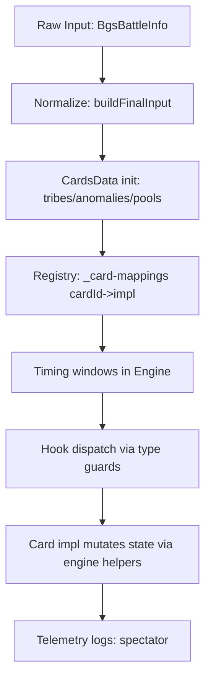

# CONTENT_PIPELINE.md

This doc explains how “content” (cards, hero powers, trinkets, spells, anomalies, quest rewards, secrets) is represented and executed in this simulator. It’s the missing bridge between:

* “I added a new card file” ✅
  and
* “It actually triggers at the right time, with the right inputs, with the right side effects” ✅✅✅

It’s based on the architecture and hook patterns in `all_ts_dump.txt` (674 TS files).

---

## 1) What “content” means here

“Content” is any rules logic that is **specific to a Battlegrounds object** identified by `cardId`, including:

* **Minions** (`BoardEntity` with a minion `cardId`)
* **Trinkets** (hero-attached `BoardTrinket`)
* **Hero powers** (`BgsHeroPower` entities)
* **Secrets** (`BoardSecret`)
* **Quest rewards** (hero-attached reward entities / ids)
* **Anomalies** (global, from `BgsGameState.anomalies`)
* **Spells / Spellcraft / BG spells** (combat-cast mechanics)

The engine runs content via **hook interfaces** defined in `src/cards/card.interface.ts`, using a registry mapping `cardId → implementation`.

---

## 2) The big picture pipeline

Key concept: **content is not executed “on its own.”** It only runs when the engine reaches the correct timing window and calls the correct hook.

---

## 3) Content taxonomy (where things live)

Under `src/cards/impl/` content is organized by category:

* `minion/` (largest)
* `trinket/`
* `hero-power/`
* `bg-spell/`
* `spellcraft/`
* `quest-reward/`
* `anomaly/`
* `spell/` (rare)

Each file typically exports a single implementation object typed to one or more hook interfaces, with a `cardIds: [...]` list.

---

## 4) Registry wiring: how content becomes “active”

### 4.1 `_card-mappings.ts` is the switchboard

`src/cards/impl/_card-mappings.ts` imports all implementations and builds:

* `cardMappings: { [cardId: string]: Card }`

This is how the engine finds behavior by `cardId`.

### 4.2 Contract: `cardIds` must be correct

An implementation must list every relevant `cardId` variant:

* normal + golden versions
* seasonal variants
* token variants, if they share behavior

If a card “does nothing,” the first check is:

* does `_card-mappings.ts` include it?
* does its `cardIds` list include the id you’re actually using?

---

## 5) Hook contracts (the “content API surface”)

### 5.1 Hook interfaces

Hooks are defined in `src/cards/card.interface.ts`. Common examples:

* `StartOfCombatCard.startOfCombat(...)`
* `BattlecryCard.battlecry(...)`
* `AvengeCard.avenge(...)`
* `RallyCard.rally(...)`
* `OnMinionAttackedCard.onAttacked(...)`
* `OnDeathCard.onDeath(...)`
* `DeathrattleSpawnCard.deathrattleSpawn(...)`
* `OnAfterDeathCard.onAfterDeath(...)`
* Spawn/despawn hooks (`onSpawned`, `onOtherSpawned`, etc)
* Keyword update hooks (`onDivineShieldUpdated`, etc)
* Stats change hook (`onStatsChanged`)

### 5.2 Type guards

The engine rarely checks hook existence by property directly. Instead it uses type guards like:

* `hasStartOfCombat(card)`
* `hasOnDeath(card)`
* `hasBattlecry(card)`

This keeps dispatch sites clean and consistent.

---

## 6) Timing windows: where content actually runs

This section is the “pipeline” part: content runs when the engine says it can run.

### 6.1 Start of Combat pipeline (SoC)

SoC is the biggest content hotspot besides deaths.

Order of SoC buckets is fixed in `start-of-combat/*`:

1. Quest rewards
2. Anomalies
3. Trinkets
4. Pre-combat hero powers
5. Illidan hero power bucket
6. Hero powers
7. Secrets
8. Minions (including SoC-from-hand variants)

**What content can do here**

* spawn minions
* buff stats / keywords
* select targets (log `power-target` ideally)
* request recompute of “who attacks first” (SoC return flag)

### 6.2 Attack-time windows

Per attack, content can run in three major windows:

1. **On Being Attacked** (defender-side):

   * secrets resolve first
   * then `OnMinionAttacked` on each defending minion

2. **On Attack** (attacker-side):

   * trinkets with `OnWheneverAnotherMinionAttacks`
   * other friendly minions with `OnWheneverAnotherMinionAttacks`
   * enchantments with that same hook
   * then Rally on attacker (and rally enchantments)

3. **After Attack**

   * minion after-attack effects first
   * death resolution
   * then trinket after-attack effects

### 6.3 Death pipeline windows

When minions die, content runs in a nested pipeline:

* `OnDeath` hooks for dead minions
* deathrattles (natural then enchantments)
* “when a deathrattle triggers” meta hooks
* avenge updates and triggers
* after-death effects
* reborn
* post-deathrattle followups
* `OnAfterDeath` hooks (trinkets first, then survivors)
* “remember deathrattle” style mechanics

### 6.4 Spawn/despawn windows

When minions are added/removed via engine helpers, content gets hooks:

* `onSpawned` (new minion)
* `onOtherSpawned` / `afterOtherSpawned` (existing minions and trinkets reacting)
* `onDespawned`
* `onSpawnFail` (board full)

**Important:** these hooks don’t fire if you splice the board yourself.

---

## 7) “What content is allowed to mutate” (and how)

Content is powerful, but there are safe and unsafe ways to change state.

### 7.1 Safe mutation paths (recommended)

Use engine controllers:

* **Stats**: `modifyStats`, `setEntityStats` (`simulation/stats.ts`)
* **Keywords**: `updateTaunt`, `updateDivineShield`, etc (`keywords/*`)
* **Summons**: `spawnEntities`, `performEntitySpawns`, `addMinionToBoard` (`simulation/spawns.ts`, `add-minion-to-board.ts`)
* **Enchantments**: `addEnchantments`, etc (`simulation/enchantments.ts`)

### 7.2 Unsafe mutation paths (avoid)

* `entity.attack += X` (bypasses stat-change watchers)
* `entity.taunt = true` (bypasses keyword watchers)
* `board.splice(...)` (bypasses spawn/despawn hooks and aura bookkeeping)

### 7.3 Why safe paths matter

Because cross-cutting systems rely on them:

* aura repair
* quest progress/counters
* keyword update hooks
* telemetry correctness

If you skip those, the sim may still “work,” but:

* replay becomes wrong
* some cards won’t trigger
* downstream interactions break

---

## 8) Content + telemetry: what should be logged

Telemetry is not required for correctness, but it is essential for debugging and replay.

### 8.1 Recommended logging for content changes

If a content effect:

* selects targets → emit `power-target`
* changes stats/keywords on a specific entity → emit `entity-upsert` (or rely on a checkpoint)
* spawns minions → spawn is logged by spawn helpers
* kills minions → deaths logged by death pipeline

### 8.2 Current reality

In the snapshot, `entity-upsert` is emitted opportunistically around `power-target` calls, not universally for all stat changes. That means:

* fat actions are often the “truth” for debugging
* thin stream is a “best-effort replay” that improves as you add upserts

---

## 9) End-to-end: adding a new minion (checklist)

### Step 1: Create implementation file

`src/cards/impl/minion/my-new-minion.ts`

Pattern:

* export `const MyNewMinion: <HookInterface> = { cardIds: [...], hook(...) { ... } }`

### Step 2: Register it

Add it to `src/cards/impl/_card-mappings.ts`

### Step 3: Pick the right hook

Examples:

* SoC buff → `StartOfCombatCard`
* “When this attacks” → `RallyCard` or `OnAttackCard` depending on semantics
* “After this attacks” → after-attack hook interface
* “Deathrattle summon” → `DeathrattleSpawnCard`

### Step 4: Implement using safe helpers

* use stats + keyword + spawn helpers
* log targeting if meaningful

### Step 5: Validate in harness

* run deterministic test harness
* verify no infinite loop guard triggers
* verify sample logs include expected event types

---

## 10) Special content types (how they differ)

### 10.1 Trinkets

* Live on hero
* Common hooks:

  * SoC triggers
  * OnWheneverAnotherMinionAttacks
  * AfterAttack (late window)
  * OnAfterDeath

Trinkets are treated like “global passive rule objects” with their own identity and sometimes avenge counters.

### 10.2 Hero powers

* Represented by `BgsHeroPower` objects
* Often trigger in SoC buckets
* Can hold `info` and `info2..info6` payload fields

Hero powers are frequently special-cased in SoC ordering (Illidan bucket).

### 10.3 Secrets

* Resolve in the “on-being-attacked” window (defender-side)
* Many secrets are reactive and must run before on-attack triggers

### 10.4 Anomalies

* Global, from `gameState.anomalies`
* Trigger in SoC anomaly bucket and sometimes affect other windows indirectly

### 10.5 Spells / Spellcraft / BG spells

* Cast via mechanics modules (`cast-tavern-spell.ts`)
* Have hooks:

  * `onTavernSpellCast`
  * `afterTavernSpellCast`

---

## 11) Content pipeline invariants (the “do not break” list)

1. **Registry is the source of truth**: if it’s not in `_card-mappings.ts`, it doesn’t exist.
2. **Hooks are timing windows**: content does not “run itself.”
3. **Safe mutation paths**: stats/keywords/spawns must use controllers.
4. **Death pipeline owns removals**: damage doesn’t remove minions.
5. **SoC can change first attacker**: if you spawn or change board size, request recompute.
6. **Telemetry is observational**: do not import replay modules into content.

---

## 12) “Pipeline debugging” cookbook

When a content change “doesn’t work”:

1. Confirm the `cardId` in the input matches what you expect.
2. Confirm the implementation file exports `cardIds: [...]` including that id.
3. Confirm `_card-mappings.ts` imports and registers the implementation.
4. Confirm the correct hook is implemented (SoC vs OnAttack vs OnDeath).
5. Set a log/breakpoint at the hook dispatch site in the engine window:

   * SoC modules for start-of-combat
   * `on-attack.ts` / `on-being-attacked.ts` for attack windows
   * deathrattle orchestration for death triggers
6. If replay looks wrong, ensure:

   * spawn/death events are emitted by using helpers
   * target selection emits `power-target`
   * state changes are visible via fat action snapshots or upserts
