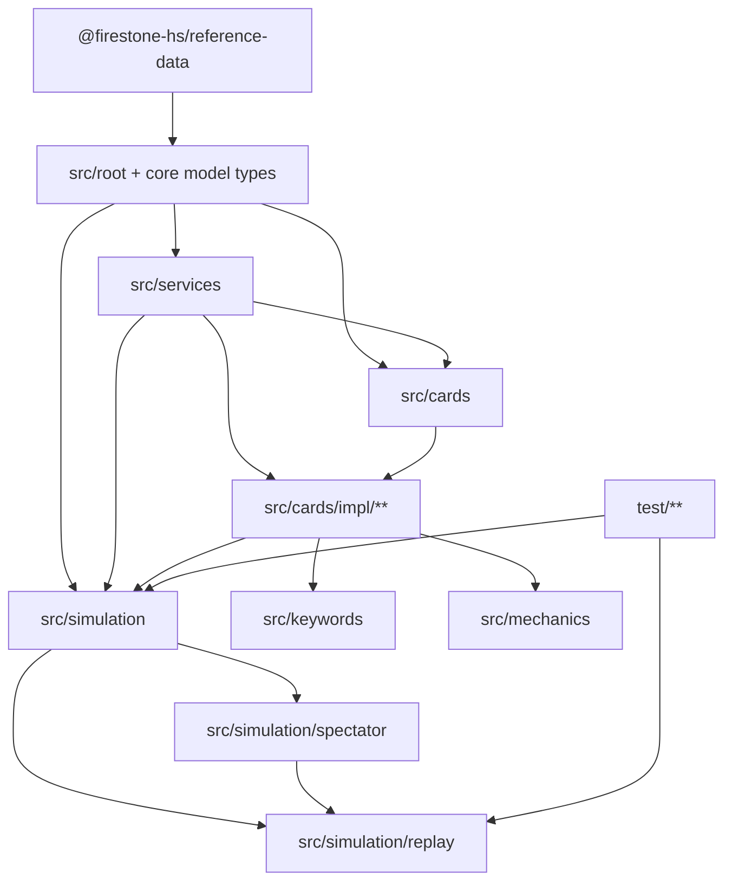

# DEPENDENCY_GRAPH.md

This dependency graph is derived from the TypeScript repository dump in **`all_ts_dump.txt`** (674 `.ts` files). 

It’s written for **onboarding + architecture sanity checks**: what depends on what, where the gravity wells are, and where cycles hide.

---

## 1) What counts as a “dependency” here

A dependency is any `import ... from 'X'` or `import 'X'` statement.

* **External deps** = module specifiers not starting with `.` (example: `@firestone-hs/reference-data`)
* **Internal deps** = relative imports (example: `../simulation/attack`), resolved to repo file paths when possible

Resolution rules used:

* `../foo/bar` resolves to `../foo/bar.ts` if present
* or `../foo/bar/index.ts` if present
* otherwise it’s marked unresolved (rare here)

---

## 2) External dependencies (what you pull from npm / node)

Only a handful appear in this TS dump:

* `@firestone-hs/reference-data` (187 importers)
* `fs` (4)
* `node:assert/strict` (2)
* `path` (1)

**Practical takeaway:** almost all complexity is internal. Your blast radius is determined by your own module layout more than by external libraries.

---

## 3) Repo “layers” (conceptual)

Even though the code has circular dependencies (see Section 6), the repo behaves like these layers:

1. **Core data model (types):** `src/board-entity.ts`, `src/bgs-player-entity.ts`, `src/bgs-battle-info.ts`, etc.
2. **Shared constants + helpers:** `src/services/card-ids.ts`, `src/services/utils.ts`, `src/utils.ts`
3. **Combat engine:** `src/simulation/*` (attacks, deaths, spawns, SoC, auras, stats)
4. **Card behavior system:** `src/cards/card.interface.ts`, `src/cards/cards-data.ts`, plus registry
5. **Card implementations:** `src/cards/impl/**` (minions, trinkets, hero powers, spells)
6. **Telemetry + replay:** `src/simulation/spectator/*`, `src/simulation/replay/*`
7. **Tests:** `test/*`

---

## 4) Directory-level dependency graph (coarse)

This is a **compressed** view: edges represent many file-level imports.

**What’s unusual here:** `impl --> sim` is expected (cards call engine helpers), but **`cards` and `sim` also import each other** via shared types, which contributes to cycles.

---

## 5) The “import gravity wells” (highest fan-in files)

These are the modules that many other files import. Changing them affects the whole repo.

Top internal hubs by number of importing files (fan-in):

1. `src/services/card-ids.ts` (imported by **597** files)
2. `src/cards/card.interface.ts` (**564**)
3. `src/board-entity.ts` (**541**)
4. `src/simulation/stats.ts` (**225**)
5. `src/utils.ts` (**223**)
6. `src/bgs-player-entity.ts` (**132**)
7. `src/simulation/cards-in-hand.ts` (**130**)
8. `src/simulation/deathrattle-on-trigger.ts` (**128**)
9. `src/services/utils.ts` (**127**)
10. `src/simulation/start-of-combat/start-of-combat-input.ts` (**120**)

**Onboarding note:** when debugging “why did everything break,” start by asking “did we touch a hub?”

---

## 6) Cycles (yes, there’s a mega-cycle)

### 6.1 The repo has a large strongly-connected component

At file level, **623 of 674 files** fall into one strongly-connected component (SCC). In plain English:

> You can follow imports from most files and eventually loop back.

This is not automatically “bad,” but it makes:

* refactors harder
* tree-shaking less effective
* incremental builds slower
* reasoning about boundaries trickier

### 6.2 A concrete small cycle you can point to

One simple example:

* `src/cards/cards-data.ts`

  * imports `src/utils.ts`
* `src/utils.ts`

  * imports `src/simulation/internal-game-state.ts`
* `src/simulation/internal-game-state.ts`

  * imports `src/cards/cards-data.ts`

That’s a tight 3-node loop.

### 6.3 The “registry cycle” (the biggest contributor)

Another big contributor is the card registry:

* `src/cards/cards-data.ts` imports `cardMappings`
* `src/cards/impl/_card-mappings.ts` imports hundreds of card implementation modules
* many implementations import engine utilities from `src/simulation/*`
* engine state pulls in `CardsData`
* which pulls in `cardMappings` again

This is why `_card-mappings.ts` is the **largest fan-out** file in the repo.

---

## 7) High fan-out files (the “octopus arms”)

These are files that import a lot of other internal modules.

Top fan-out:

1. `src/cards/impl/_card-mappings.ts` imports **511** internal modules (basically every card impl)

Then a steep drop:

* `src/simulation/start-of-combat/soc-action-processor.ts` (63)
* `src/cards/card.interface.ts` (25)
* `src/simulation/attack.ts` (24)
* `src/simulation/avenge.ts` (18)
* `src/simulation/battlecries.ts` (17)
* `src/simulation/deathrattle-effects.ts` (17)

**Onboarding note:** `_card-mappings.ts` is the “compile-time aggregator.” If build time hurts, that file is your first suspect.

---

## 8) The most common cross-directory edges

Counted as “number of resolved file-to-file imports that cross group boundaries.”

Top edges (what depends on what most often):

* `src/cards/impl/minion` → `src/simulation` (766)
* `src/cards/impl/minion` → `src/root` (605)
* `src/cards/impl/minion` → `src/services` (508)
* `src/cards/impl/minion` → `src/cards` (437)
* `src/cards/impl` → `src/cards/impl/minion` (431)
  (this is `_card-mappings.ts` importing minions)

Secondary edges:

* `src/simulation` → `src/root` (99)
* `src/cards/impl/trinket` → `src/root` (62)
* `src/cards/impl/minion` → `src/simulation/start-of-combat` (54)
* `src/cards/impl/minion` → `src/keywords` (53)
* `src/cards/impl/trinket` → `src/simulation` (52)

**Interpretation:** card implementations are the primary consumers of engine and model types.

---

## 9) “Rule of thumb” dependency direction (how to keep your brain unknotted)

Even with cycles, most code follows these intent-level rules:

### Prefer these directions

* **Card impls** depend on:

  * model types (`BoardEntity`, `BgsPlayerEntity`)
  * services (`CardIds`, random helpers)
  * simulation helpers (`attack`, `stats`, `spawns`)
* **Simulation** depends on:

  * model types
  * card hook interfaces (`card.interface.ts`) and registry (`cardMappings`)
* **Telemetry/replay** depends on:

  * model types (sanitized)
  * spectator type unions
  * replay reducer

### Avoid introducing new “uphill” edges

These tend to worsen cycles:

* `src/simulation/*` importing directly from `src/cards/impl/**`
* `src/services/*` importing from `src/cards/impl/**`
* `src/cards/impl/**` importing from spectator/replay (unless it’s explicitly logging)

---

## 10) Suggested “future boundary cuts” (optional refactor notes)

If you ever want a cleaner DAG, these are the highest ROI separations:

1. **Extract hook input types**
   Move `SoCInput`, `OnAttackInput`, etc. into `src/types/` (or `src/contracts/`) so:

   * `src/cards/card.interface.ts` does not need to import engine modules
   * engine modules can import contracts without importing cards

2. **Invert `CardsData` dependency on `cardMappings`**
   Instead of `CardsData` importing the registry, inject registry into `CardsData` at construction time. That breaks a major loop.

3. **Split `_card-mappings.ts` into multiple registries**
   Load registries per category (minion/trinket/hero-power) then merge, or lazy-load per test/feature. Helps build times and reduces “one-file-to-rule-them-all.”

---

## 11) Tiny “how to trace dependencies” cheat sheet (for new devs)

* “Who imports this file?”
  Search for `from '../path/to/file'` in the dump, or grep in repo.
* “What does this file import?”
  Look at the top of the file. If it imports `card-ids.ts` or `card.interface.ts`, it’s likely part of gameplay logic.
* “Where is card behavior wired?”
  `src/cards/impl/_card-mappings.ts`

---

## 12) Known unresolved imports (small)

A few test files reference paths/assets not present as TS files in this dump:

* `../../src/simulation/apply-event` (likely an older path for `src/simulation/replay/apply-event.ts`)
* `./game.json` (non-TS test asset)

These are not harmful for the conceptual graph, but they matter if you’re trying to compile from the dump alone.
