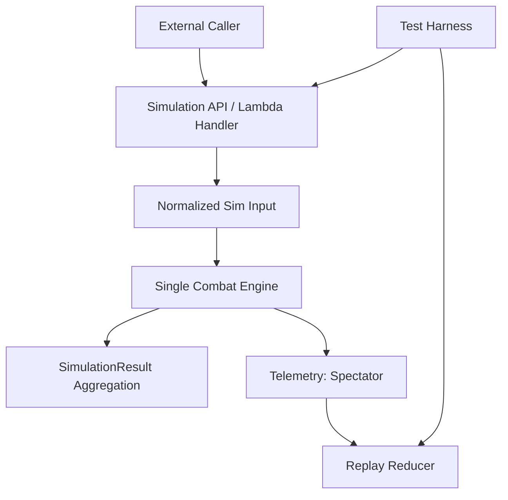

# IO_CONTRACTS.md

This document defines the **input/output contracts** for the simulator at every major boundary: external API I/O, internal engine I/O, telemetry I/O, replay I/O, and test harness I/O. It’s based on the structures and boundary patterns visible in `all_ts_dump.txt`.

If you’re new: treat this as “what shape does this thing expect/produce?” plus “what invariants must hold across the boundary?”

---

## 1) Contract map (where I/O happens)



Boundaries:

1. **External → Simulator**: `BgsBattleInfo` in, `SimulationResult` out
2. **Raw input → Normalized input**: `buildFinalInput(...)`
3. **Normalized input → Per-iteration state**: `cloneInput3(...)` → `FullGameState`
4. **Engine → Aggregator**: `SingleSimulationResult` and damage, plus optional samples
5. **Engine → Telemetry**: `SpectatorEvent[]`, `GameAction[]`, `SpectatorCheckpoint[]`
6. **Telemetry → Replay**: `applyEvent(...)` and `reconstructAt(...)`

---

## 2) External API I/O (public boundary)

### 2.1 Input: `BgsBattleInfo`

This is the top-level payload for one simulation request.

```ts
interface BgsBattleInfo {
  playerBoard: BgsBoardInfo;
  playerTeammateBoard?: BgsBoardInfo;
  opponentBoard: BgsBoardInfo;
  opponentTeammateBoard?: BgsBoardInfo;
  options: BgsBattleOptions;
  gameState: BgsGameState;
  heroHasDied?: boolean;
}
```

#### Key invariants for callers

* `playerBoard` and `opponentBoard` must be present.
* Board order matters (left-to-right).
* Entity identity must be stable:

  * `entityId` unique within input
  * `cardId` is a real battlegrounds card id string
* `friendly` should match side:

  * player minions `friendly: true`
  * opponent minions `friendly: false`
* Hero power state should prefer `heroPowers[]` over deprecated single hero power fields.

---

### 2.2 Input: `BgsBoardInfo`

```ts
interface BgsBoardInfo {
  player: BgsPlayerEntity;
  board: BoardEntity[];
  secrets?: BoardSecret[]; // deprecated, prefer player.secrets
}
```

**Caller guidance**

* Put secrets on `player.secrets` unless you’re sending legacy format.

---

### 2.3 Input: `BgsBattleOptions`

```ts
interface BgsBattleOptions {
  numberOfSimulations: number;
  maxAcceptableDuration?: number; // ms, early stop
  intermediateResults?: number; // yield cadence
  includeOutcomeSamples?: boolean;
  damageConfidence?: number;
  validTribes?: Race[]; // deprecated, prefer gameState.validTribes
  skipInfoLogs: boolean;
}
```

**Semantics**

* `numberOfSimulations` controls accuracy vs speed.
* `maxAcceptableDuration` may stop early; output still valid but lower confidence.
* `includeOutcomeSamples` enables sample payloads (bigger output).

---

### 2.4 Input: `BgsGameState`

```ts
interface BgsGameState {
  currentTurn: number;
  validTribes?: Race[];
  anomalies?: string[];
}
```

**Caller guidance**

* Use `gameState.validTribes` and `gameState.anomalies` for season context.

---

### 2.5 Output: `SimulationResult`

Output is always a JSON object containing:

* win/tie/loss counts and percents
* damage aggregates and ranges
* optional `outcomeSamples` when enabled

**Important behavior**

* raw per-run arrays (`damageWons`, `damageLosts`) may be cleared before return to reduce payload size.

---

### 2.6 Lambda handler I/O

The default export in `src/simulate-bgs-battle.ts` behaves like:

**Request**

* `event.body`: JSON stringified `BgsBattleInfo`

**Response**

* `{ statusCode: 200, body: JSON.stringify(SimulationResult) }`

**Caller recommendation**

* Add schema validation at the service boundary if using in production.

---

## 3) Normalization boundary (raw input → sim-ready input)

### 3.1 Function contract: `buildFinalInput(...)`

**Input**

* raw-ish `BgsBattleInfo`

**Output**

* normalized `BgsBattleInfo` (same top-level shape, but cleaned data)

**Normalization responsibilities**

* fill missing defaults where expected
* normalize ghosts / dead heroes
* fix missing auras / repair state so engine can assume invariants
* consolidate legacy fields where possible

**Invariants after normalization**

* `friendly` flags consistent
* boards are safe to mutate without referencing shared objects
* required hero fields exist (`hpLeft`, `tavernTier`, `heroPowers[]`, etc)

---

## 4) Per-iteration boundary (normalized input → mutable runtime state)

### 4.1 Function contract: `cloneInput3(...)`

**Input**

* normalized battle input

**Output**

* deep-ish clone suitable for mutation during simulation iteration

**Invariants**

* no references shared between iterations
* `entityId`s preserved
* enchantments/secrets/trinkets cloned sufficiently to avoid mutation bleed

### 4.2 Runtime state: `FullGameState`

Each iteration constructs a `FullGameState` with:

* services: `allCards`, `cardsData`
* shared counters: `sharedState`
* telemetry sink: `spectator`
* mutable combat state: `gameState.player/opponent` and baselines `playerInitial/opponentInitial`

**Invariants**

* `sharedState.currentEntityId` is initialized above any existing id so spawn ids are unique.

---

## 5) Engine I/O (single combat)

### 5.1 Entry: `Simulator.simulateSingleBattle(...)`

**Inputs**

* mutable `FullGameState` containing player/opponent states
* battle context (turn, valid tribes, anomalies)

**Outputs**

* `SingleSimulationResult` (won/lost/tied + damage)
* optional telemetry emitted through `FullGameState.spectator`

**Engine invariants**

* entities are removed only by death pipeline
* spawns occur through spawn helper pathways
* the combat terminates (deadlocks handled, safety caps exist)

---

## 6) Aggregation I/O (Monte Carlo)

### 6.1 `simulateBattle(...)` generator output

**Inputs**

* `BgsBattleInfo`

**Outputs**

* yields intermediate `SimulationResult` periodically (if configured)
* returns final `SimulationResult`

**Invariants**

* intermediate results are internally consistent (percents computed from completed iterations)
* final results may be partial if max duration triggered early

---

## 7) Telemetry I/O (Spectator)

Telemetry is an internal I/O boundary that becomes external if you export it to a UI.

### 7.1 Thin event stream: `SpectatorEvent[]`

**Purpose**

* replay-friendly reconstruction

**Event types (high level)**

* SoC marker: `start-of-combat`
* attack step: `attack`
* minion damage: `damage`
* targeting: `power-target`
* state patch: `entity-upsert`
* topology add: `spawn`
* topology remove: `minion-death`
* end damage: `player-attack`, `opponent-attack`

**Critical invariants**

* `seq` strictly increases
* removals happen only via `minion-death`
* spawns happen only via `spawn`

### 7.2 Checkpoints: `SpectatorCheckpoint[]`

**Purpose**

* fast seek
* bridge test validation

**Schema**

* `seq`, reason, snapshot (`GameAction` fat action)

### 7.3 Fat actions: `GameAction[]`

**Purpose**

* human/debug-friendly “story”
* checkpoint snapshot container

Each action includes `GameEventContext`:

* boards/hands/secrets/trinkets
* hero ids + hero power info
* quest reward metadata fields

**Sanitization invariant**

* actions/checkpoints must store sanitized/cloned entity snapshots, not mutable live objects.

---

## 8) Replay I/O (events/checkpoints → reconstructed state)

### 8.1 Replay reducer: `applyEvent(...)`

**Input**

* current replay state
* a single `SpectatorEvent`

**Output**

* new replay state

**Semantic invariants**

* `damage` reduces health but does not remove entities
* `minion-death` removes entities
* `spawn` adds entities
* `entity-upsert` patches or inserts entity state

### 8.2 Reconstruct: `reconstructAt(targetSeq)`

**Inputs**

* `checkpoints`, `events`, `targetSeq`

**Output**

* reconstructed board projection at `targetSeq`

**Correctness invariant**

* checkpoint A + apply events to seq B must match checkpoint B’s snapshot under the chosen projection.

---

## 9) Test harness I/O

### 9.1 Seeded runs

Tests patch RNG for determinism:

* seeded-runner patches `Math.random` via Mulberry32

### 9.2 Full-game harness

The harness uses a scenario input (often JSON assets) and runs the simulator, printing or asserting results.

**I/O invariants**

* tests must not depend on wall clock time
* tests should capture stable transcripts for regression when possible

---

## 10) Canonical “projection” contracts (for hashing and equivalence)

Because engine state is rich and mutable, comparisons should use a canonical projection:

### 10.1 Replay projection (recommended default)

* uses sanitized entity fields only
* preserves board order

Used for:

* replay equivalence tests
* checkpoint hashes
* bisecting divergence

### 10.2 Debug projection

* uses fat action snapshots and full context
* larger, but easier to reason about

---

## 11) Contract checks (what to validate at boundaries)

### 11.1 External input validation (recommended)

* unique entityIds
* numeric sanity: no NaN/Infinity
* board size <= 7
* friendly flags consistent
* minimal hero fields present

### 11.2 Engine internal assertions (recommended in debug builds)

* entityId uniqueness across both boards
* board size <= 7
* death batch closure termination
* attackImmediately cleared after use
* no entity exists on both sides simultaneously

### 11.3 Replay validation

* bridge test: checkpoint A → events → checkpoint B
* full-run test: replay from start → final snapshot

---

## 12) Practical “what contract am I touching?” guide

If you change…

* `BoardEntity` fields → affects **everything** (API, engine, telemetry, replay)
* attack ordering → affects **telemetry ordering** and **replay assumptions**
* spawn insertion → affects **telemetry spawn indexes** and adjacency semantics
* keyword update helpers → affects **trigger correctness** and **replay-visible state**
* spectator event schema → must update **applyEvent** and docs
* normalization → affects **input contract** tolerance and correctness
