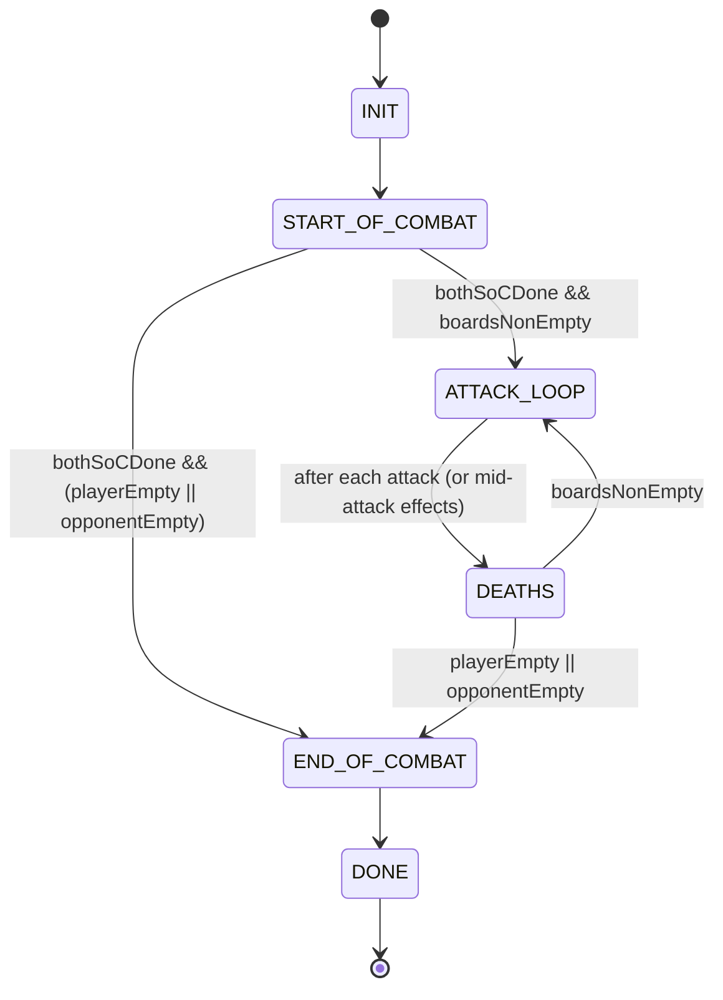
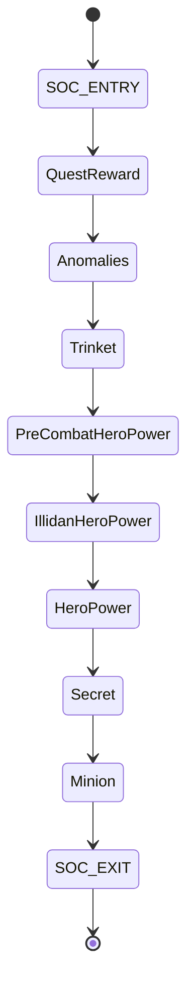
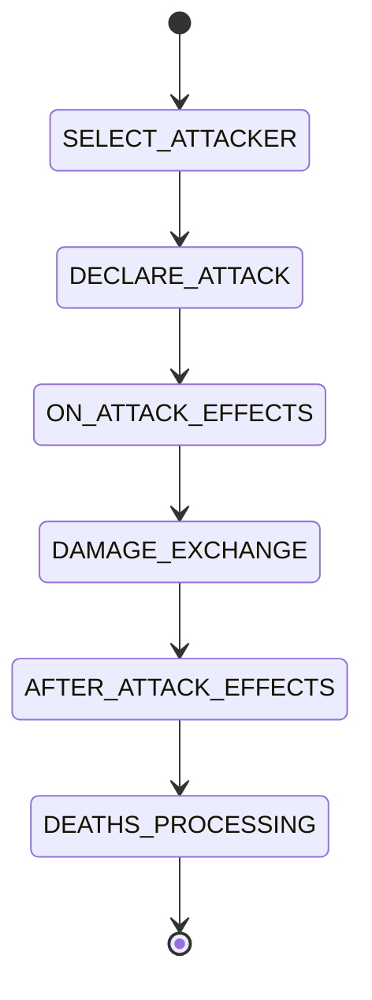

According to a document snapshot (undated export) in `all_ts_dump.txt`, your combat engine already behaves like a **real state machine**, even if it’s currently expressed as a `while (...)` loop plus a handful of “phase handlers”. Below is a comprehensive `STATE_MACHINE.md` you can drop into `docs/llm/STATE_MACHINE.md` (or wherever you keep your LLM packet).

---

# STATE_MACHINE.md

## 0) What this document is

This describes the **combat-time state machine** for the Battlegrounds-style simulator. It focuses on:

* The **macro phases** the combat progresses through.
* The **sub-phases** inside Start-of-Combat and Attack resolution.
* The **state variables** that define “where we are” and “what happens next”.
* How this state machine maps to the **Spectator thin event log + checkpoints** (replay architecture).

Sources referenced are from the concatenated TypeScript dump (`all_ts_dump.txt`).

---

## 1) The combat state machine at a glance

### 1.1 Macro states

Combat progresses through these macro states:

1. **INIT**
2. **START_OF_COMBAT**
3. **ATTACK_LOOP**
4. **DEATHS** (batched / as-needed resolution)
5. **END_OF_COMBAT**
6. **DONE**

In code today, these are implicitly driven by the `Simulator.simulateSingleBattle()` loop condition:

* keep looping while **either hero’s Start-of-Combat isn’t done** OR **both boards still have minions**. 

So “DONE” is reached only when:

* `playerEntity.startOfCombatDone === true`
* `opponentEntity.startOfCombatDone === true`
* and at least one board is empty (`playerBoard.length === 0 || opponentBoard.length === 0`)

### 1.2 Mermaid (macro)

---

## 2) Core state variables (the “combat register file”)

### 2.1 Simulator-owned pointers

Inside `src/simulation/simulator.ts`, the simulator owns:

* `currentAttacker: number` (which side attacks next, usually `0` or `1`)
* `currentSpeedAttacker: number` (appears to relate to “speed attacker” logic, initialized to `-1`) 
* `hasShowShortCircuitWarning: boolean` (debug/guardrail) 

### 2.2 SharedState (global combat scratchpad)

`src/simulation/shared-state.ts` defines shared mutable combat scratch:

* `anomalies: readonly string[]`
* `currentEntityId: number` (next ID for spawned entities)
* `currentAttackerEntityId: number | null` (tracks the entity currently attacking)
* `deaths: BoardEntity[]` (death processing staging area)
* `debug: boolean` 

This is the closest thing you have to a “blackboard” that multiple subsystems read/write.

### 2.3 Entity-level flags

At least one key per-hero flag:

* `playerEntity.startOfCombatDone`
* `opponentEntity.startOfCombatDone`

These are explicitly set `true` at the end of `handleStartOfCombat(...)`. 

---

## 3) INIT → START_OF_COMBAT

### 3.1 EntityId initialization

At the top of `simulateSingleBattle`, you compute the max entityId across boards + enchantments + hands and set:

* `gameState.sharedState.currentEntityId = maxEntityId + 1` 

This is a critical invariant: **every spawn must consume `currentEntityId++`** to avoid collisions.

---

## 4) START_OF_COMBAT (SOC) sub-state machine

`handleStartOfCombat(...)` is the SOC “runner”. It does two key jobs:

1. **Decides/updates the initial attacker**
2. **Executes ordered SOC phases**

### 4.1 Initial attacker selection (SOC entry)

On SOC entry, attacker is recomputed as:

* if one board longer: longer board attacks first
* else: random coin flip via `Math.round(Math.random())` 

This is a state transition guard: it sets `currentAttacker` before SOC phases start.

### 4.2 SOC phase ordering (canonical list)

SOC phases (as currently executed) are:

1. `QuestReward`
2. `Anomalies`
3. `Trinket`
4. `PreCombatHeroPower`
5. `IllidanHeroPower`
6. `HeroPower`
7. `Secret`
8. `Minion` 

Each phase is dispatched through `handlePhase(...)` (a `switch`) and may:

* mutate boards/heroes
* change `currentAttacker`
* (rarely) **force** the attacker outcome via `forcedAttacker` semantics 

At SOC end:

* both heroes set `startOfCombatDone = true`
* `applyAfterStatsUpdate(gameState)` runs
* attacker returned is `forcedAttacker ?? currentAttacker` 

### 4.3 Mermaid (SOC)

### 4.4 Who goes first inside a phase (ordering randomness)

Several SOC handlers decide “which player resolves first” via a coin flip (`Math.random() < 0.5`), e.g. secrets and hero powers. 

This means SOC is not just “a list of phases”, it’s a **tree** where each phase may branch into:

* resolve friendly then opponent
* or opponent then friendly

### 4.5 SOC Minions: the “micro-loop”

`soc-minion.ts` shows a second inner loop for SOC minion triggers:

* chooses an `attackerForStart = (Math.random() < 0.5 ? 0 : 1)` 
* builds attacker queues:

  * from hand triggers first (`hasStartOfCombatFromHand(...)`)
  * then board minions 
* loops until both queues empty, toggling `attackerForStart` when one side is out of attackers 

There’s also a comment noting behavior uncertainty and a desire (as of 2025-11-16) to resolve one side completely then the other, but the current loop still conditionally alternates. 

### 4.6 SOC Illidan hero power: can force attacker

`soc-illidan-hero-power.ts`:

* uses a coin flip to determine which player’s Illidan resolution runs first 
* runs both players’ Illidan handling
* then calls `processMinionDeath(...)`
* then may `handleSummonsWhenSpace(...)` and recompute attacker 

It returns `{ attacker, force }`, where `force` can propagate up and become `forcedAttacker` at SOC-level. 

### 4.7 “Deaths during SOC”

SOC actions can optionally process deaths immediately. `performStartOfCombatAction(...)` includes a `processDeaths` flag and may call `processMinionDeath(...)` right after an SOC trigger fires. 

So SOC isn’t “pure pre-combat setup”; it can enter **DEATHS** resolution mid-SOC.

---

## 5) ATTACK_LOOP (attack state machine)

Even though `CombatPhase` names exist for Spectator (`ATTACK`, `DEATHS`, etc.), your engine already has a clear “attack transaction”.

### 5.1 Attack transaction order (single attack)

From `attack.ts` (via snippet):

1. Apply pre-attack / before-attack effects (not fully shown in snippet)
2. `applyOnAttackEffects(...)`
3. `performAttack(...)` (does the actual damage exchange)
4. `applyAfterAttackEffects(...)`
5. `processMinionDeath(...)` 

There’s an explicit comment acknowledging timing ambiguity and suggesting a split between:

* “minion after attack” phase
* “trinket after attack” phase 

That comment is basically a neon sign saying: **this is a state machine and the states need names**.

### 5.2 Mermaid (single attack transaction)

---

## 6) DEATHS (batched resolution)

Deaths get processed in multiple places:

* after Illidan SOC hero power handling 
* after standard attacks 
* optionally during SOC actions (`performStartOfCombatAction`) 

The mechanism uses:

* `processMinionDeath(...)` (central)
* `SharedState.deaths` as a staging list 

This strongly suggests DEATHS is a **re-entrant sub-state**: you can enter it from SOC or ATTACK, and you exit it back to whichever macro phase is still active.

---

## 7) END_OF_COMBAT

On the Spectator side, you already model “hero damage dealt” as END_OF_COMBAT events:

* `player-attack` (damage)
* `opponent-attack` (damage)
  and you explicitly include `END_OF_COMBAT` in `CombatPhase`. 

That implies the intended macro flow:

* Once one board is empty, compute hero damage and emit one of those events.

(If you want the state machine to be fully explicit, END_OF_COMBAT should be the only place where hero damage is computed/emitted.)

---

## 8) Mapping the engine to Spectator’s event-log state machine

You currently have **two parallel representations** of “combat progress”:

1. **Engine state** (boards/heroes/sharedState + control variables)
2. **Spectator telemetry** (thin events + periodic checkpoints)

### 8.1 Spectator event phases (thin log)

`SpectatorEvent` includes:

* `start-of-combat` (phase: `START_OF_COMBAT`)
* `attack` (phase: `ATTACK`)
* `damage` (phase: `ATTACK` or `DEATHS`)
* `power-target` (phase: `START_OF_COMBAT` | `ATTACK` | `DEATHS`)
* `entity-upsert` (phase: `START_OF_COMBAT` | `ATTACK` | `DEATHS`)
* `spawn` (phase: `DEATHS`)
* `minion-death` (phase: `DEATHS`)
* `player-attack` / `opponent-attack` (phase: `END_OF_COMBAT`) 

This already matches your macro states almost 1:1.

### 8.2 Checkpoints (thick log)

You also define checkpointing mechanics:

* `CHECKPOINT_EVERY_N_EVENTS = 200` 
* `CheckpointReason = SOC_START | SOC_END | ATTACK_END | DEATH_BATCH_END | EVERY_N | MANUAL` 
* Spectator supports `checkpointNow(reason)` to create a checkpoint snapshot from last-known context. 

The design intent is clear: thin events for causality, thick snapshots for recovery/debugging.

### 8.3 Alternative log type: CombatLog (replay-oriented)

You also have a more replay-oriented `CombatLog` model:

* `CombatEventBase` with monotonic `seq` + optional `parents` for causal linkage
* event types like `DEATHS`, `SPAWN`, `POWER_TARGETS`, `HERO_DAMAGE`, etc.
* `CombatCheckpoint` optionally includes `rng?: RngCursor` for deterministic resume 

This is the “state machine transcript” that can drive a replayer.

---

## 9) Where randomness touches the state machine (important!)

These state transitions currently depend on `Math.random()`:

* Initial attacker selection when boards are equal size (SOC entry) 
* SOC minion trigger ordering (`attackerForStart`) 
* Several SOC “resolve friendly vs opponent first” coin flips (hero powers, secrets, Illidan ordering) 

If you’re building replay determinism, these random-dependent transitions must be driven by the **same seeded RNG stream** that Spectator/CombatLog can checkpoint.

---

## 10) Practical “state machine boundaries” you should name (even if they’re functions today)

Here are the boundaries that want to become explicit state machine transitions (and ideal checkpoint points):

* `SOC_START` (before first SOC phase)
* `SOC_END` (after `startOfCombatDone = true` for both) 
* `ATTACK_DECLARED` (attacker/defender locked)
* `ATTACK_DAMAGE_DONE` (after `performAttack`)
* `ATTACK_END` (after `applyAfterAttackEffects`)
* `DEATH_BATCH_START` / `DEATH_BATCH_END`
* `END_OF_COMBAT` (hero damage computed/emitted) 

These line up directly with your `CheckpointReason` enum. 

---

## 11) File map (where the state machine lives)

Core:

* `src/simulation/simulator.ts` (macro loop + combat termination condition) 
* `src/simulation/shared-state.ts` (shared mutable state) 
* `src/simulation/start-of-combat/start-of-combat.ts` (SOC phase runner + ordering) 
* `src/simulation/start-of-combat/soc-minion.ts` (SOC minion micro-loop) 
* `src/simulation/start-of-combat/soc-illidan-hero-power.ts` (Illidan SOC, can force attacker) 
* `src/simulation/attack.ts` (attack transaction + calls into death processing) 

Telemetry / replay:

* `src/simulation/spectator/spectator-types.ts` (thin events + phases) 
* `src/simulation/spectator/spectator.ts` (event capture + checkpoints) 
* `src/simulation/spectator/combat-log.types.ts` (replay-oriented log model) 

---

## 12) TODOs (state machine hardening checklist)

1. Replace `Math.random()` usage in **transition decisions** with injected RNG (seeded), so “state machine branching” is replayable. (SOC is the big offender.) 
2. Make DEATHS explicitly re-entrant but deterministic: define exactly when `handleSummonsWhenSpace(...)` is allowed to run (several SOC paths call it). 
3. Promote the “after attack” ambiguity comment into formal sub-states so ordering is testable. 
4. Align engine boundaries with `CheckpointReason` and call `spectator.checkpointNow(...)` at those boundaries. 
