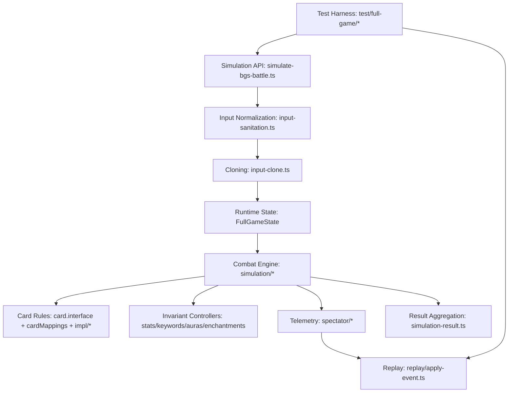

# SYSTEMS_OVERVIEW.md

A “systems map” of the Battlegrounds combat simulator captured in `all_ts_dump.txt`. This is meant for **new-dev onboarding**: what the major subsystems are, how they interact, what invariants each subsystem relies on, and where to make changes safely.

---

## 1) What this codebase is

A **Battlegrounds combat simulator** that:

* takes two boards (plus hero attachments like trinkets, hero powers, quests, secrets, anomalies)
* runs **many single-combat simulations** (Monte Carlo)
* returns **win / tie / loss** rates + **damage distributions**
* optionally records **telemetry** (thin event stream + snapshots) for replay/debugging

It is not a full Battlegrounds engine (no shop phase). It focuses on combat resolution.

---

## 2) Systems at a glance

---

## 3) Core concepts (shared vocabulary)

* **Board**: ordered `BoardEntity[]` left-to-right
* **Entity**: a minion-like object with `entityId`, `cardId`, stats, keywords
* **Hero state**: `BgsPlayerEntity` (hpLeft, tavernTier, trinkets, hero powers, quests, secrets, counters)
* **FullGameState**: the per-iteration container that holds both sides plus shared counters/services
* **Timing windows**: Start of Combat, Attack, Deaths, End of Combat (coarse phases)

---

## 4) System 1: Simulation API and orchestration

### Responsibility

Owns the outer loop and execution mode:

* **Library mode**: call `simulateBattle(battleInfo)` generator directly
* **Service mode**: Lambda-style handler that reads JSON input and returns a JSON result

### Key files

* `src/simulate-bgs-battle.ts` (main entrypoint + Monte Carlo generator)
* `src/simulation-result.ts` (aggregated output)
* `src/single-simulation-result.ts` (one-run outcome)

### Invariants

* Each iteration must start from a clean clone of normalized input.
* `Simulator` is instantiated per iteration, not reused across iterations.

---

## 5) System 2: Input pipeline (Normalization + Cloning)

### 5.1 Input normalization

**Responsibility**
Turn “real world” board payloads into a consistent sim-ready shape:

* fill missing fields
* repair aura inconsistencies
* normalize ghosts / dead heroes
* attach defaults like `friendly` flags if needed

**Key file**

* `src/input-sanitation.ts` (`buildFinalInput(...)`)

**Invariant**
Combat code should not need to do defensive “is field missing” checks everywhere.

### 5.2 Cloning

**Responsibility**
Prevent mutation bleed between iterations and support “initial snapshot” state:

* clone the normalized input into per-iteration mutable objects
* keep a second clone for `playerInitial/opponentInitial` baseline

**Key file**

* `src/input-clone.ts` (`cloneInput3(...)`)

**Invariant**
Entities are mutated heavily during combat, so cloning is mandatory for correctness.

---

## 6) System 3: Runtime state model

### Responsibility

Provide a single container that the engine and cards can pass around.

**Key types**

* `FullGameState` contains:

  * `allCards` (card database service)
  * `cardsData` (derived battlegrounds metadata, pools, helper lookups)
  * `sharedState` (mutable counters like `currentEntityId`)
  * `spectator` (telemetry sink)
  * `gameState` (player/opponent `PlayerState`, plus initial baselines)

**Key file**

* `src/simulation/internal-game-state.ts`

### Invariants

* `sharedState.currentEntityId` must always be ahead of all existing entity IDs so spawns get unique IDs.
* `playerInitial/opponentInitial` should represent the iteration’s starting snapshot.

---

## 7) System 4: RNG and determinism

### Responsibility

The simulator uses randomness for:

* target selection
* ordering ambiguities (coin flips)
* tie-breakers (who attacks first if boards equal)

**Current pattern**

* Many sites call `Math.random()`
* Deterministic tests patch `Math.random()` with a seeded PRNG (Mulberry32)

**Key file**

* `src/lib/rng.ts`
* `test/full-game/seeded-runner.ts`

### Invariants

* A deterministic run depends on:

  * stable initial state
  * stable RNG stream
  * stable iteration order of lists (board arrays are stable, object key iteration should be avoided for randomness)

---

## 8) System 5: Combat engine (the “physics” layer)

The combat engine lives under `src/simulation/*`. It’s procedural and built around explicit timing windows.

### 8.1 Engine orchestrator

**Responsibility**
Run a single combat from start to finish:

* Start of Combat once per active hero
* attack loop until termination
* death resolution loops until stable
* end-of-combat hero damage calculation

**Key file**

* `src/simulation/simulator.ts`

### 8.2 Start of Combat pipeline

**Responsibility**
Resolve pre-attack effects in ordered buckets:

* quest rewards
* anomalies
* trinkets
* hero powers (including special Illidan timing)
* secrets
* minion SoC effects

**Key folder**

* `src/simulation/start-of-combat/*`

**Invariants**

* SoC may request a recompute of first attacker when it changes board topology.
* SoC should not “half apply” effects. Either mutate fully or not at all, because later phases build on it.

### 8.3 Attack resolution

**Responsibility**
Pick attacker, pick defender, resolve attack and all attack-time triggers.

**Key files**

* `src/simulation/attack.ts`
* `src/simulation/on-attack.ts`
* `src/simulation/on-being-attacked.ts`
* `src/simulation/after-attack.ts`

**Important ordering (high level)**

1. declare attack (telemetry)
2. on-being-attacked window (defender secrets and hooks)
3. on-attack window (attacker-side hooks, rally)
4. damage exchange (combat damage + keyword side effects)
5. after-attack minion effects
6. deaths pipeline
7. after-attack trinkets
8. cleanup

### 8.4 Death pipeline and orchestration

**Responsibility**
Remove dead minions in batches and resolve everything that happens because they died:

* OnDeath hooks
* deathrattles (natural then enchantments)
* avenge counters and triggers
* reborn
* post-death followups
* recursion until stable

**Key files**

* `src/simulation/minion-death.ts`
* `src/simulation/deathrattle-orchestration.ts`
* `src/simulation/deathrattle-effects.ts`
* `src/simulation/deathrattle-spawns.ts`
* `src/simulation/reborn.ts`

**Critical invariant**

* Minions are removed only by the death pipeline, not by damage application.

### 8.5 Spawns and board operations

**Responsibility**
Insert/remove entities safely while maintaining invariants:

* enforce board size limit
* compute insertion index (left/right based)
* apply auras and spawn hooks
* handle special “attack immediately” minions

**Key files**

* `src/simulation/spawns.ts`
* `src/simulation/add-minion-to-board.ts`
* `src/simulation/remove-minion-from-board.ts`
* `src/simulation/summon-when-space.ts`

**Invariant**
All summoning should route through these helpers so:

* auras remain consistent
* spawn hooks fire
* telemetry can log consistent placement

### 8.6 Cross-cutting mechanics inside the engine

These are “shared rule modules” used by many cards:

* **Stats**: `src/simulation/stats.ts`
* **Auras**: `src/simulation/auras.ts`
* **Enchantments**: `src/simulation/enchantments.ts`
* **Battlecries**: `src/simulation/battlecries.ts`
* **Magnetize**: `src/simulation/magnetize.ts`
* **Secrets**: `src/simulation/secrets.ts`
* **Quests**: `src/simulation/quest.ts`
* **Avenge**: `src/simulation/avenge.ts`
* **Blood gems**: `src/simulation/blood-gems.ts`

---

## 9) System 6: Card rules system (hooks + registry + implementations)

This is how the engine “asks content what to do” without hardcoding every card into engine logic.

### 9.1 Hook interfaces and type guards

**Responsibility**
Define the set of timing windows and their input payloads:

* Start of Combat hooks
* OnAttack / OnMinionAttacked / Rally hooks
* OnDamaged / AfterDealDamage hooks
* OnDeath / Deathrattle hooks
* Spawn/despawn hooks
* Keyword-change hooks (OnDivineShieldUpdated, etc)
* Stats-change hooks (OnStatsChanged)

**Key file**

* `src/cards/card.interface.ts`

### 9.2 Registry mapping cardId to implementation

**Responsibility**
One place that imports and aggregates every implementation file.

**Key file**

* `src/cards/impl/_card-mappings.ts`

**Invariant**
Ideally this is the only “mass importer” in the repo. Everything else should call into it indirectly.

### 9.3 Implementations (content)

**Responsibility**
Actual behaviors for minions, trinkets, hero powers, spells, etc.

**Key folder**

* `src/cards/impl/**`

  * `minion/`, `trinket/`, `hero-power/`, `bg-spell/`, `spellcraft/`, etc

**Invariant**
Implementations should mutate state through engine helpers:

* stats via stats helpers
* keywords via keyword update helpers
* spawns via spawn helpers

---

## 10) System 7: Keyword subsystem (special case)

Keywords are common enough to be their own “system” because changing a keyword is often not a trivial boolean set.

**Key folder**

* `src/keywords/*` (divine shield, reborn, stealth, taunt, venomous, windfury)

**Invariant**
If you bypass keyword helpers, you bypass:

* keyword-change hooks
* special bookkeeping fields
* some hidden interactions

---

## 11) System 8: Telemetry and replay

### 11.1 Spectator (recording)

**Responsibility**
Record what happened for:

* outcome samples
* replay debugging
* state reconstruction at a sequence

Two representations exist:

* **Thin event log**: minimal events with `seq`, phases, entity IDs, sanitized payloads
* **Fat actions**: full context snapshots (boards, hands, secrets, trinkets, hero power info)

**Key folder**

* `src/simulation/spectator/*`

### 11.2 Replay reducer (reconstruction)

**Responsibility**
Seek quickly using checkpoints:

* start from nearest checkpoint ≤ target `seq`
* apply thin events forward until target `seq`

**Key folder**

* `src/simulation/replay/*`

### Invariants

* Thin log events must not rely on mutable entity references, only sanitized snapshots.
* Entity removal must be represented by explicit death events, not by health reaching 0.
* Checkpoints must be authoritative snapshots at their `seq`.

---

## 12) System 9: Tests and harness

### Responsibility

* Validate determinism via seeded RNG patching
* Run full-game harness based on a scenario input (often JSON assets)
* Provide replay debugging utilities

**Key folder**

* `test/full-game/*`
* RNG smokes under `test/`

**Invariant**
Tests may import from anywhere in `src`, but `src` must never import from `test`.

---

## 13) Common change patterns (where to modify safely)

### Adding a new card behavior

1. Implement hook in `src/cards/impl/<category>/<your-card>.ts`
2. Add to `_card-mappings.ts`
3. If no hook exists, add hook interface and type guard in `card.interface.ts`
4. Wire hook call site in the correct engine window (`simulation/*`)

### Fixing attack ordering bugs

Start at:

* `simulation/attack.ts`
* then `on-being-attacked.ts`, `on-attack.ts`, `after-attack.ts`
* verify death pipeline and post-attack trinket timing

### Fixing spawn placement or aura drift

Start at:

* `simulation/spawns.ts`
* `add-minion-to-board.ts`
* `auras.ts`
* then check telemetry spawn indexes if replay depends on placement

### Making telemetry richer

Prefer:

* emit `power-target` plus `entity-upsert` to reflect state changes
* avoid inventing a dozen new micro-event types unless you also update replay reducer

---

## 14) “Do not break” invariants (short list)

1. **Death pipeline is the only remover** of entities from boards.
2. **Spawns go through spawn helpers** so hooks and auras remain consistent.
3. **Keyword toggles go through keyword helpers** so watchers fire.
4. **Stats changes go through stats helpers** so enchantments and watchers remain consistent.
5. **Replay uses sanitized state** and explicit death/spawn boundaries.

---

## 15) Suggested onboarding reading order

1. `src/simulate-bgs-battle.ts` (outer loop + normalization + result aggregation)
2. `src/simulation/internal-game-state.ts` (data containers)
3. `src/simulation/simulator.ts` (single combat conductor)
4. `src/simulation/attack.ts` (attack pipeline)
5. `src/simulation/minion-death.ts` + `deathrattle-orchestration.ts` (death closure)
6. `src/cards/card.interface.ts` + `src/cards/impl/_card-mappings.ts` (hooks + registry)
7. `src/simulation/spectator/*` + `src/simulation/replay/*` (telemetry and replay)
